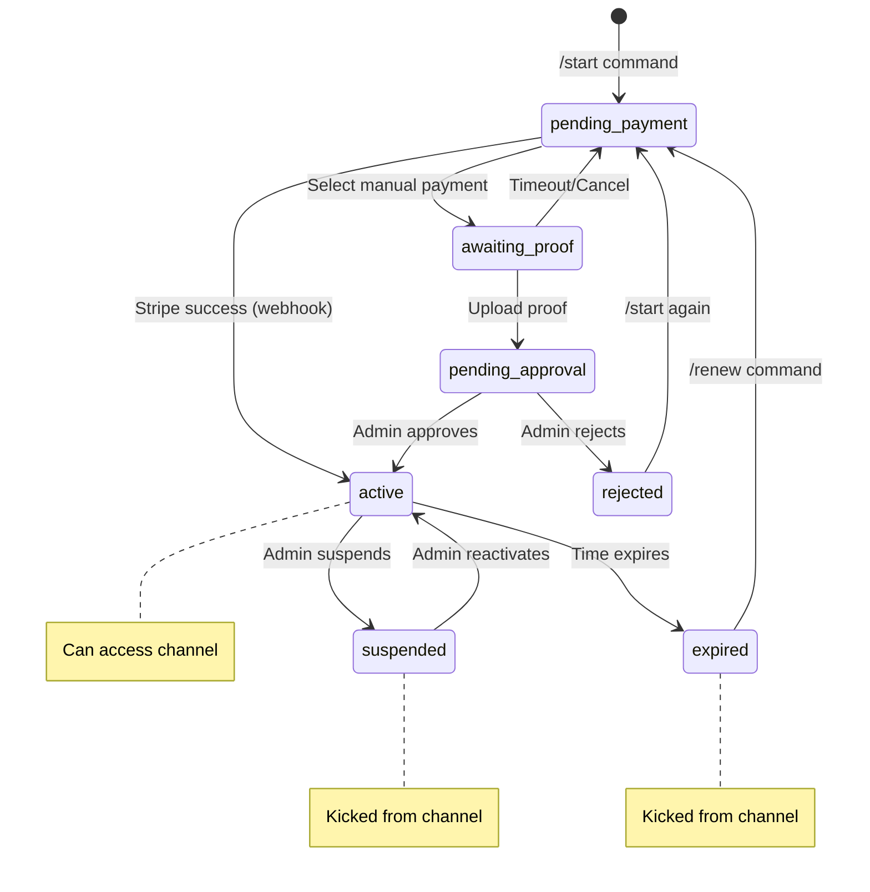

# SubscribeHub - Complete Technical Documentation

> **Last Updated:** December 2024  
> **Version:** 2.0  
> **Platform:** Telegram Subscription Management SaaS  
> **Tech Stack:** React 18 + TypeScript + Supabase + Telegram Bot API + Stripe

---

## Table of Contents

1. [Project Overview](#1-project-overview)
2. [Complete User Journeys](#2-complete-user-journeys)
3. [System Architecture](#3-system-architecture)
4. [Feature-by-Feature Technical Breakdown](#4-feature-by-feature-technical-breakdown)
5. [Code Structure Documentation](#5-code-structure-documentation)
6. [Database Documentation](#6-database-documentation)
7. [Edge Functions Documentation](#7-edge-functions-documentation)
8. [Integrations](#8-integrations)
9. [Business Logic & Rules](#9-business-logic--rules)
10. [Security Review](#10-security-review)
11. [API Reference](#11-api-reference)
12. [Testing Strategy](#12-testing-strategy)
13. [Deployment Guide](#13-deployment-guide)
14. [Missing Parts & Roadmap](#14-missing-parts--roadmap)
15. [Enhancement Suggestions](#15-enhancement-suggestions)
16. [Final Summary](#16-final-summary)

---

## 1. Project Overview

### 1.1 What is SubscribeHub?

SubscribeHub is a **Software-as-a-Service (SaaS) platform** that empowers content creators, educators, and community managers to monetize their Telegram channels through paid subscriptions. The platform automates the entire subscription lifecycle from user acquisition to access management.

### 1.2 Core Problem Statement

Content creators face several challenges when monetizing Telegram channels:
- **Manual member tracking** - Manually adding/removing members
- **Payment verification** - No automated payment confirmation
- **Renewal management** - Forgetting to remind users about renewals
- **Access control** - Difficulty revoking access for expired subscribers

### 1.3 Solution Overview

SubscribeHub solves these problems by providing:

| Feature | Description | Automation Level |
|---------|-------------|------------------|
| **Subscriber Acquisition** | Telegram bot handles onboarding | Fully Automated |
| **Payment Collection** | Manual (bank) + Stripe (card) | Semi/Fully Automated |
| **Access Management** | Auto-generate invite links | Fully Automated |
| **Renewal Reminders** | 3-day and 1-day warnings | Fully Automated |
| **Expiry Handling** | Auto-kick from channel | Fully Automated |
| **Admin Notifications** | Telegram alerts to admins | Fully Automated |

### 1.4 User Types

| User Type | Role | Capabilities |
|-----------|------|--------------|
| **Super Admin** | Platform Owner | Manage all clients, view all payments, platform settings, payment methods |
| **Client** | Channel Owner | Create projects, manage subscribers, configure payments, view analytics |
| **Subscriber** | End User | Subscribe via Telegram bot, pay, access channel, renew |

### 1.5 Business Model

The platform operates on a **B2B2C model**:
- **B2B**: Clients pay for platform access (subscription plans with limits)
- **B2C**: Subscribers pay clients for channel access (platform takes no cut from these payments)

### 1.6 Suggested Enhancements

| Enhancement | Priority | Description |
|-------------|----------|-------------|
| 🔴 **Platform Revenue Share** | High | Option to take percentage of each subscriber payment |
| 🟡 **White-Label Solution** | Medium | Allow clients to use custom branding |
| 🟡 **Affiliate Program** | Medium | Referral system for client acquisition |
| 🟢 **Multi-Currency Support** | Low | Support more currencies beyond USD |
| 🟢 **Mobile App** | Low | Native mobile app for clients |

---

## 2. Complete User Journeys

### 2.1 Client Journey (Channel Owner)

#### Journey Map


#### Step-by-Step Details

**Step 1: Account Creation**
```
URL: /signup
Fields: Full Name, Email, Password
Validation: Email format, Password min 6 chars
Result: 
  - auth.users record created
  - profiles record (via trigger)
  - user_roles record as 'client' (via trigger)
  - 14-day trial subscription (via trigger)
```

**Step 2: Project Creation**
```
URL: /projects (modal dialog)
Fields:
  - Project Name (3-50 chars)
  - Bot Token (format: 123456789:ABCdefGHI...)
  - Channel ID (-100123456789 or @channelname)
  - Support Contact (optional, @username or URL)

Validation Process:
  1. Frontend Zod validation
  2. Edge function validation:
     - getMe() - validates bot token
     - getChat() - validates channel exists
     - getChatMember() - validates bot is admin
     - Check "can_invite_users" permission
  3. Auto webhook setup via setWebhook()
```

**Step 3: Plan Configuration**
```
Fields per plan:
  - Plan Name (e.g., "Weekly", "Monthly", "Premium")
  - Price (numeric, 2 decimal places)
  - Currency (default: USD)
  - Duration (days: 7, 30, 90, 365, etc.)
  - Description (optional, shown in bot)
  - Active/Inactive toggle
  - Stripe Price ID (optional, for Stripe integration)
```

### 2.2 Subscriber Journey (Telegram User)

#### Sequence Diagram

```mermaid
sequenceDiagram
    participant U as 👤 Telegram User
    participant B as 🤖 Bot
    participant S as ⚙️ System
    participant A as 👨‍💼 Admin Dashboard
    participant C as 📺 Private Channel

    Note over U,C: ONBOARDING FLOW
    U->>B: /start
    B->>S: Check existing subscriber
    S-->>B: New user or returning
    B->>U: Welcome message + plan options
    
    Note over U,C: PLAN SELECTION
    U->>B: Click plan button
    B->>S: Record plan selection
    B->>U: Choose payment method:<br/>💳 Stripe / 🏦 Manual

    alt Manual Payment Flow
        U->>B: Select Manual Payment
        B->>U: Bank details + instructions
        Note over U: User makes bank transfer
        U->>B: Send payment screenshot 📷
        B->>S: Update status: pending_approval
        S->>A: Show in pending list
        Note over A: Admin reviews payment
        A->>S: Approve payment ✅
        S->>B: Trigger notification
        S->>S: Generate invite link
        B->>U: ✅ Approved! Join link: [link]
        U->>C: Click link & join
    else Stripe Payment Flow
        U->>B: Select Card Payment
        B->>S: Create checkout session
        S-->>B: Checkout URL
        B->>U: "Pay Now" button
        U->>U: Complete Stripe payment 💳
        S->>S: Webhook: checkout.completed
        S->>S: Generate invite link
        S->>B: Send confirmation
        B->>U: ✅ Payment confirmed! Link: [link]
        U->>C: Click link & join
    end

    Note over U,C: SUBSCRIPTION LIFECYCLE
    loop Daily Check
        S->>S: check-expiring-subscriptions
    end
    
    S->>S: 3 days before expiry
    S->>B: Send reminder
    B->>U: ⚠️ Expiring in 3 days! /renew

    S->>S: 1 day before expiry
    S->>B: Send final warning
    B->>U: 🚨 EXPIRES TOMORROW! /renew

    S->>S: Expiry date reached
    S->>C: Ban user (kicks)
    S->>B: Send expiry notice
    B->>U: ❌ Subscription expired<br/>Use /renew to resubscribe
```



#### Bot Commands Reference

| Command | Description | When Available | Response |
|---------|-------------|----------------|----------|
| `/start` | Begin subscription | Always | Shows plans or current status |
| `/status` | Check subscription | Always | Plan name, expiry, days left |
| `/renew` | Renew subscription | Always | Shows plans with extension info |
| `/help` | Show help | Always | Lists commands + support contact |

#### Subscriber Status State Machine



### 2.3 Super Admin Journey

```mermaid
flowchart TB
    subgraph Dashboard["Admin Dashboard"]
        direction TB
        A[🏠 Overview] --> |Stats| A1[Total Clients]
        A --> A2[Total Revenue]
        A --> A3[Active Subscriptions]
    end
    
    subgraph Clients["Client Management"]
        B[👥 All Clients] --> B1[View Details]
        B --> B2[View Projects]
        B --> B3[Manage Subscription]
    end
    
    subgraph Payments["Payment Management"]
        C[💰 Payments] --> C1[Review Proofs]
        C --> C2[Approve/Reject]
        C --> C3[Payment History]
    end
    
    subgraph Settings["Platform Settings"]
        D[⚙️ Settings] --> D1[Subscription Plans]
        D --> D2[Payment Methods]
        D --> D3[Platform Config]
    end
    
    Dashboard --> Clients
    Dashboard --> Payments
    Dashboard --> Settings
```



### 2.4 Suggested Enhancements for User Journeys

| Enhancement | Journey | Priority | Description |
|-------------|---------|----------|-------------|
| 🔴 **Onboarding Wizard** | Client | High | Step-by-step guided setup with progress indicator |
| 🔴 **Video Tutorials** | Client | High | Embedded video guides for bot setup |
| 🟡 **Quick Actions** | All | Medium | One-click common actions from dashboard |
| 🟡 **Subscription Pause** | Subscriber | Medium | Allow subscribers to pause instead of cancel |
| 🟡 **Trial Period** | Subscriber | Medium | Free trial access before payment |
| 🟢 **Referral Tracking** | Client | Low | Track which subscribers came from referrals |
| 🟢 **Custom Bot Messages** | Client | Low | Allow clients to customize bot responses |

---

## 3. System Architecture

### 3.1 Technology Stack

| Layer | Technology | Version | Purpose |
|-------|------------|---------|---------|
| **Frontend Framework** | React | 18.3.1 | UI components and state |
| **Type System** | TypeScript | 5.x | Type safety |
| **Build Tool** | Vite | 5.x | Fast HMR and bundling |
| **Styling** | Tailwind CSS | 3.x | Utility-first CSS |
| **UI Components** | shadcn/ui | Latest | Accessible components |
| **State Management** | TanStack Query | 5.x | Server state caching |
| **Routing** | React Router | 6.x | Client-side routing |
| **Animations** | Framer Motion | 12.x | Smooth animations |
| **Forms** | React Hook Form + Zod | 7.x + 3.x | Form handling + validation |
| **Backend** | Supabase | Latest | PostgreSQL + Auth + Edge Functions |
| **Payments** | Stripe | Latest | Card payments |
| **Messaging** | Telegram Bot API | Latest | User notifications |

### 3.2 High-Level Architecture Diagram

```mermaid
flowchart TB
    subgraph ClientLayer["Client Layer"]
        WEB["🌐 React Web App<br/>(SPA)"]
        TG["📱 Telegram Users"]
    end
    
    subgraph SupabaseLayer["Supabase Cloud"]
        subgraph Auth["Authentication"]
            AUTH["🔐 Supabase Auth<br/>(JWT)"]
        end
        
        subgraph Database["Database"]
            DB[("🗄️ PostgreSQL<br/>+ RLS Policies")]
        end
        
        subgraph Functions["Edge Functions"]
            EF1["telegram-bot-handler"]
            EF2["validate-project-setup"]
            EF3["setup-telegram-webhook"]
            EF4["create-checkout-session"]
            EF5["stripe-webhook"]
            EF6["check-expiring-subscriptions"]
            EF7["notify-subscriber"]
        end
        
        subgraph Storage["Storage"]
            STORE["📁 payment-proofs<br/>(private bucket)"]
        end
    end
    
    subgraph ExternalAPIs["External Services"]
        TELEGRAM["🤖 Telegram Bot API"]
        STRIPE["💳 Stripe API"]
    end
    
    WEB -->|"Auth Requests"| AUTH
    WEB -->|"CRUD Operations"| DB
    WEB -->|"RPC Calls"| Functions
    WEB -->|"File Upload"| STORE
    
    TG -->|"Webhook"| EF1
    
    EF1 -->|"Bot API"| TELEGRAM
    EF7 -->|"Notifications"| TELEGRAM
    EF6 -->|"Reminders"| TELEGRAM
    
    EF4 -->|"Create Session"| STRIPE
    STRIPE -->|"Webhook"| EF5
    
    Functions -->|"CRUD"| DB
    
    style ClientLayer fill:#e1f5fe
    style SupabaseLayer fill:#f3e5f5
    style ExternalAPIs fill:#fff3e0
```



### 3.3 Data Flow Diagrams

#### Payment Processing Flow


#### Subscription Expiry Flow


### 3.4 Suggested Architecture Enhancements

| Enhancement | Priority | Description |
|-------------|----------|-------------|
| 🔴 **Message Queue** | High | Add Redis/BullMQ for reliable background jobs |
| 🔴 **CDN Integration** | High | CloudFlare for static assets and caching |
| 🟡 **Read Replicas** | Medium | Database read replicas for scaling |
| 🟡 **Monitoring** | Medium | Add Sentry for error tracking |
| 🟡 **APM** | Medium | Application performance monitoring |
| 🟢 **GraphQL Layer** | Low | Optional GraphQL API for flexibility |
| 🟢 **Microservices** | Low | Split edge functions into separate services |

---

## 4. Feature-by-Feature Technical Breakdown

### 4.1 Authentication System

**Files Involved:**
- `src/hooks/useAuth.tsx` - Auth context and hooks
- `src/hooks/useUserRole.tsx` - Role checking
- `src/components/layout/AuthLayout.tsx` - Protected routes
- `src/pages/auth/*` - Login, Signup, Password reset

**Authentication Flow:**


**Key Code Snippets:**

```typescript
// useAuth.tsx - Sign up implementation
const signUp = async (email: string, password: string, fullName: string) => {
  const { error } = await supabase.auth.signUp({
    email,
    password,
    options: {
      data: { full_name: fullName }
    }
  });
  return { error };
};

// Role-based access check
const { isAdmin, isClient, isLoading } = useUserRole();
```

**Database Trigger:**
```sql
CREATE OR REPLACE FUNCTION handle_new_user()
RETURNS TRIGGER AS $$
BEGIN
  -- Create profile
  INSERT INTO public.profiles (user_id, email, full_name)
  VALUES (NEW.id, NEW.email, NEW.raw_user_meta_data->>'full_name');
  
  -- Assign role
  INSERT INTO public.user_roles (user_id, role)
  VALUES (NEW.id, 
    CASE WHEN NEW.email = 'admin@subscribehub.com' 
         THEN 'super_admin' ELSE 'client' END);
  
  -- Create trial subscription
  INSERT INTO public.client_subscriptions (client_id, status, trial_ends_at)
  VALUES (NEW.id, 'trial', NOW() + INTERVAL '14 days');
  
  RETURN NEW;
END;
$$ LANGUAGE plpgsql SECURITY DEFINER;
```

**Suggested Enhancements for Authentication:**

| Enhancement | Priority | Description |
|-------------|----------|-------------|
| 🔴 **OAuth Providers** | High | Add Google, GitHub, Discord login |
| 🔴 **2FA** | High | Two-factor authentication option |
| 🟡 **Password Strength** | Medium | Real-time password strength indicator |
| 🟡 **Session Management** | Medium | View/revoke active sessions |
| 🟡 **Login History** | Medium | Track login attempts with IP/device |
| 🟢 **Magic Link** | Low | Passwordless email login |
| 🟢 **Biometric** | Low | Fingerprint/FaceID for mobile |

---

### 4.2 Project Management

**Files Involved:**
- `src/pages/Projects.tsx` - Projects list page
- `src/components/projects/CreateProjectDialog.tsx` - Create modal
- `src/components/projects/EditProjectDialog.tsx` - Edit modal
- `src/components/projects/PlansDialog.tsx` - Plan management
- `supabase/functions/validate-project-setup/` - Validation
- `supabase/functions/setup-telegram-webhook/` - Webhook setup

**Validation Pipeline:**


**Project Data Model:**
```typescript
interface Project {
  id: string;
  user_id: string;
  project_name: string;
  bot_token: string;           // Encrypted in DB
  channel_id: string;          // -100xxx or @username
  admin_telegram_id: number;   // Bot's Telegram ID
  admin_username: string;      // Bot's @username
  support_contact: string;     // Optional @username or URL
  status: 'active' | 'inactive';
  stripe_config: {
    enabled: boolean;
    secret_key?: string;       // Stored securely
    webhook_secret?: string;
  };
  manual_payment_config: {
    enabled: boolean;
    instructions: string;      // Bank details, etc.
  };
  created_at: string;
  updated_at: string;
}
```

**Suggested Enhancements for Projects:**

| Enhancement | Priority | Description |
|-------------|----------|-------------|
| 🔴 **Multiple Channels per Project** | High | Support groups + channels together |
| 🔴 **Project Templates** | High | Pre-configured project types |
| 🟡 **Project Cloning** | Medium | Duplicate project with all settings |
| 🟡 **Project Analytics** | Medium | Per-project revenue and growth stats |
| 🟡 **Scheduled Messages** | Medium | Send broadcast to all subscribers |
| 🟢 **Project Archiving** | Low | Archive instead of delete |
| 🟢 **Team Members** | Low | Multiple admins per project |

---

### 4.3 Telegram Bot Handler

**Location:** `supabase/functions/telegram-bot-handler/index.ts`

**Webhook URL Pattern:**
```
https://fcmwixdlmbauyznvcfti.supabase.co/functions/v1/telegram-bot-handler?project_id={uuid}
```

**Request Processing Flow:**


**Command Handlers:**

| Handler | Trigger | Actions |
|---------|---------|---------|
| `handleStart` | `/start` | Create/fetch subscriber, show plans or status |
| `handleStatus` | `/status` | Show subscription details, expiry countdown |
| `handleRenew` | `/renew` | Show plans with extension info |
| `handleHelp` | `/help` | List commands, show support contact |
| `handlePlanSelection` | `callback:plan_*` | Record plan choice, show payment options |
| `handlePaymentMethod` | `callback:pay_*` | Process payment method selection |
| `handlePhoto` | Photo message | If awaiting_proof, mark as pending_approval |

**Bot Message Templates:**

```typescript
const messages = {
  welcome: "👋 Welcome to {channel_name}!\n\nChoose a subscription plan:",
  
  planSelected: "📦 You selected: {plan_name}\n💰 Price: ${price}\n⏱ Duration: {days} days\n\nChoose payment method:",
  
  manualInstructions: "🏦 Bank Transfer Instructions:\n\n{instructions}\n\n📸 Send a screenshot of your payment proof.",
  
  pendingApproval: "✅ Payment proof received!\n\nWaiting for admin approval. You'll be notified soon.",
  
  approved: "🎉 Your payment has been approved!\n\n🔗 Join the channel: {invite_link}\n\n📅 Valid until: {expiry_date}",
  
  expiring3Days: "⚠️ Your subscription expires in 3 days!\n\n📅 Expiry: {expiry_date}\n\nUse /renew to extend.",
  
  expiring1Day: "🚨 FINAL WARNING!\n\nYour subscription expires TOMORROW.\n\nUse /renew NOW to avoid losing access.",
  
  expired: "❌ Your subscription has expired.\n\nUse /renew to resubscribe and regain access."
};
```

**Suggested Enhancements for Bot Handler:**

| Enhancement | Priority | Description |
|-------------|----------|-------------|
| 🔴 **Rate Limiting** | High | Prevent bot spam (per user + global) |
| 🔴 **Multi-Language** | High | Support English, Spanish, Arabic, etc. |
| 🟡 **Custom Commands** | Medium | Let clients add custom bot commands |
| 🟡 **Rich Media Messages** | Medium | Support images, videos in bot responses |
| 🟡 **Inline Mode** | Medium | @bot inline queries for sharing |
| 🟡 **Deep Linking** | Medium | Referral tracking via /start?ref=xxx |
| 🟢 **Bot Menu Button** | Low | Configure commands in Telegram UI |
| 🟢 **Chat Actions** | Low | "typing..." indicators |

---

### 4.4 Payment Processing

#### 4.4.1 Manual Payments

**Flow:**
1. User clicks "Manual Payment" in bot
2. Bot shows bank transfer instructions from `project.manual_payment_config.instructions`
3. User makes external transfer
4. User sends screenshot to bot
5. System marks status as `pending_approval`
6. Admin sees in dashboard, reviews proof
7. Admin approves → `notify-subscriber` edge function called
8. System generates invite link, sends to user

**Data Stored:**
```typescript
// On payment proof upload
await supabase.from('subscribers').update({
  status: 'pending_approval',
  payment_proof_url: 'Photo received via Telegram', // or actual URL if uploaded via dashboard
  payment_method: 'manual'
}).eq('id', subscriber.id);
```

#### 4.4.2 Stripe Payments

**Checkout Session Creation:**

```typescript
// create-checkout-session edge function
const session = await stripe.checkout.sessions.create({
  mode: 'payment',
  payment_method_types: ['card'],
  line_items: [{
    price_data: {
      currency: plan.currency.toLowerCase(),
      product_data: {
        name: plan.plan_name,
        description: `${plan.duration_days} days access`
      },
      unit_amount: Math.round(plan.price * 100) // cents
    },
    quantity: 1
  }],
  client_reference_id: subscriber_id,
  metadata: {
    project_id,
    plan_id,
    subscriber_id,
    telegram_user_id
  },
  success_url: 'https://t.me/?payment=success',
  cancel_url: 'https://t.me/?payment=cancelled'
});
```

**Webhook Processing:**

```typescript
// stripe-webhook edge function
const event = stripe.webhooks.constructEvent(
  body,
  signature,
  process.env.STRIPE_WEBHOOK_SECRET
);

if (event.type === 'checkout.session.completed') {
  const session = event.data.object;
  
  // 1. Get metadata
  const { project_id, plan_id, subscriber_id, telegram_user_id } = session.metadata;
  
  // 2. Calculate expiry
  const plan = await getPlan(plan_id);
  const expiryDate = new Date();
  expiryDate.setDate(expiryDate.getDate() + plan.duration_days);
  
  // 3. Generate invite link
  const inviteLink = await createChannelInviteLink(botToken, channelId);
  
  // 4. Update subscriber
  await supabase.from('subscribers').update({
    status: 'active',
    payment_method: 'stripe',
    start_date: new Date().toISOString(),
    expiry_date: expiryDate.toISOString(),
    invite_link: inviteLink
  }).eq('id', subscriber_id);
  
  // 5. Send confirmation
  await sendTelegramMessage(botToken, telegram_user_id, 
    `🎉 Payment successful!\n\nJoin here: ${inviteLink}`);
}
```

**Suggested Enhancements for Payments:**

| Enhancement | Priority | Description |
|-------------|----------|-------------|
| 🔴 **Subscription Mode** | High | Recurring Stripe subscriptions |
| 🔴 **Refund Processing** | High | Handle Stripe refund webhooks |
| 🔴 **PayPal Integration** | High | Alternative payment provider |
| 🟡 **Crypto Payments** | Medium | Bitcoin, USDT, etc. |
| 🟡 **Invoice Generation** | Medium | PDF invoices for payments |
| 🟡 **Promo Codes** | Medium | Discount codes for subscribers |
| 🟢 **Payment Plans** | Low | Installment payments |
| 🟢 **Currency Conversion** | Low | Auto-convert prices |

---

### 4.5 Subscription Lifecycle Management

**Edge Function:** `supabase/functions/check-expiring-subscriptions/index.ts`

**Trigger:** Scheduled cron job or manual invocation

**Processing Logic:**

```typescript
async function processExpiringSubscriptions() {
  const now = new Date();
  const threeDaysFromNow = new Date(now.getTime() + 3 * 24 * 60 * 60 * 1000);
  const oneDayFromNow = new Date(now.getTime() + 1 * 24 * 60 * 60 * 1000);
  
  // 1. Find subscriptions expiring in 3 days (first reminder)
  const threeDayWarnings = await supabase
    .from('subscribers')
    .select('*, plans(*), projects(*)')
    .eq('status', 'active')
    .eq('expiry_reminder_sent', false)
    .lte('expiry_date', threeDaysFromNow.toISOString())
    .gte('expiry_date', oneDayFromNow.toISOString());
  
  for (const sub of threeDayWarnings.data) {
    await sendExpiryReminder(sub, '3 days');
    await supabase.from('subscribers')
      .update({ expiry_reminder_sent: true })
      .eq('id', sub.id);
  }
  
  // 2. Find subscriptions expiring in 1 day (final reminder)
  const oneDayWarnings = await supabase
    .from('subscribers')
    .select('*, plans(*), projects(*)')
    .eq('status', 'active')
    .eq('final_reminder_sent', false)
    .lte('expiry_date', oneDayFromNow.toISOString())
    .gte('expiry_date', now.toISOString());
  
  for (const sub of oneDayWarnings.data) {
    await sendFinalReminder(sub);
    await supabase.from('subscribers')
      .update({ final_reminder_sent: true })
      .eq('id', sub.id);
  }
  
  // 3. Process expired subscriptions
  const expired = await supabase
    .from('subscribers')
    .select('*, plans(*), projects(*)')
    .eq('status', 'active')
    .lt('expiry_date', now.toISOString());
  
  for (const sub of expired.data) {
    // Kick from channel
    await kickFromChannel(sub.projects.bot_token, sub.projects.channel_id, sub.telegram_user_id);
    
    // Update status
    await supabase.from('subscribers')
      .update({ status: 'expired' })
      .eq('id', sub.id);
    
    // Notify user
    await sendExpiredNotification(sub);
  }
}
```

**Suggested Enhancements for Lifecycle:**

| Enhancement | Priority | Description |
|-------------|----------|-------------|
| 🔴 **Grace Period** | High | 1-3 day grace period before kick |
| 🔴 **Auto-Renewal** | High | Automatic renewal for Stripe subscribers |
| 🟡 **Early Renewal Discount** | Medium | Discount for renewing before expiry |
| 🟡 **Pause Subscription** | Medium | Pause instead of expire |
| 🟡 **Win-Back Campaigns** | Medium | Special offers for expired subscribers |
| 🟢 **Expiry Prediction** | Low | ML-based churn prediction |

---

### 4.6 Admin Notifications (notify-subscriber)

**Edge Function:** `supabase/functions/notify-subscriber/index.ts`

**Supported Actions:**

| Action | Trigger | Telegram Message | Additional Action |
|--------|---------|------------------|-------------------|
| `approved` | Admin approves payment | Success + invite link | Generate invite link |
| `rejected` | Admin rejects payment | Rejection + reason | - |
| `suspended` | Admin suspends | Suspension notice | Kick from channel |
| `kicked` | Admin force kicks | Removal notice | Kick from channel |
| `reactivated` | Admin reactivates | Reactivation + new link | Generate invite link |

**Request Format:**
```typescript
interface NotifyRequest {
  subscriber_id: string;
  action: 'approved' | 'rejected' | 'suspended' | 'kicked' | 'reactivated';
  reason?: string;        // For rejection/suspension
  invite_link?: string;   // Pre-generated link (optional)
  expiry_date?: string;   // For approval
}
```

---

## 5. Code Structure Documentation

### 5.1 Directory Structure

```
subscribehub/
├── public/
│   ├── favicon.ico
│   ├── robots.txt
│   └── placeholder.svg
│
├── src/
│   ├── components/
│   │   ├── admin/                 # Super admin components
│   │   │   └── PaymentMethodsManager.tsx
│   │   │
│   │   ├── billing/               # Billing/subscription UI
│   │   │   └── ContactSalesDialog.tsx
│   │   │
│   │   ├── landing/               # Public landing page
│   │   │   ├── HeroSection.tsx
│   │   │   ├── FeaturesSection.tsx
│   │   │   ├── HowItWorksSection.tsx
│   │   │   ├── PricingSection.tsx
│   │   │   ├── TestimonialsSection.tsx
│   │   │   ├── SocialProofSection.tsx
│   │   │   ├── FAQSection.tsx
│   │   │   ├── CTABanner.tsx
│   │   │   ├── LandingNavbar.tsx
│   │   │   └── Footer.tsx
│   │   │
│   │   ├── layout/                # Layout wrappers
│   │   │   ├── AuthLayout.tsx     # Protected route wrapper
│   │   │   ├── DashboardLayout.tsx
│   │   │   └── Sidebar.tsx        # Collapsible sidebar
│   │   │
│   │   ├── projects/              # Project management
│   │   │   ├── CreateProjectDialog.tsx
│   │   │   ├── EditProjectDialog.tsx
│   │   │   └── PlansDialog.tsx
│   │   │
│   │   ├── subscribers/           # Subscriber management
│   │   │   ├── AddSubscriberDialog.tsx
│   │   │   ├── SubscriberDetails.tsx
│   │   │   └── PaymentProofUpload.tsx
│   │   │
│   │   ├── ui/                    # shadcn/ui components
│   │   │   ├── button.tsx
│   │   │   ├── card.tsx
│   │   │   ├── dialog.tsx
│   │   │   ├── table.tsx
│   │   │   └── ... (40+ components)
│   │   │
│   │   ├── NavLink.tsx            # Active route link
│   │   └── PageTransition.tsx     # Route transitions
│   │
│   ├── hooks/
│   │   ├── useAuth.tsx            # Authentication context
│   │   ├── useUserRole.tsx        # Role-based access
│   │   ├── use-mobile.tsx         # Responsive detection
│   │   └── use-toast.ts           # Toast notifications
│   │
│   ├── pages/
│   │   ├── auth/
│   │   │   ├── Login.tsx
│   │   │   ├── Signup.tsx
│   │   │   ├── ForgotPassword.tsx
│   │   │   └── ResetPassword.tsx
│   │   │
│   │   ├── admin/                 # Super admin pages
│   │   │   ├── AdminOverview.tsx
│   │   │   ├── AdminClients.tsx
│   │   │   ├── AdminPayments.tsx
│   │   │   └── AdminSettings.tsx
│   │   │
│   │   ├── Landing.tsx            # Public home
│   │   ├── Dashboard.tsx          # Client dashboard
│   │   ├── Projects.tsx           # Project list
│   │   ├── Subscribers.tsx        # Subscriber management
│   │   ├── Analytics.tsx          # Analytics dashboard
│   │   ├── Settings.tsx           # User settings
│   │   ├── Billing.tsx            # Platform billing
│   │   └── NotFound.tsx           # 404 page
│   │
│   ├── integrations/
│   │   └── supabase/
│   │       ├── client.ts          # Supabase client (auto-generated)
│   │       └── types.ts           # Database types (auto-generated)
│   │
│   ├── lib/
│   │   └── utils.ts               # Utility functions (cn, etc.)
│   │
│   ├── App.tsx                    # Root component + routes
│   ├── App.css                    # Global styles
│   ├── index.css                  # Tailwind + custom CSS
│   └── main.tsx                   # Entry point
│
├── supabase/
│   ├── config.toml                # Supabase config
│   ├── migrations/                # Database migrations (read-only)
│   └── functions/
│       ├── telegram-bot-handler/
│       │   └── index.ts
│       ├── validate-project-setup/
│       │   └── index.ts
│       ├── setup-telegram-webhook/
│       │   └── index.ts
│       ├── create-checkout-session/
│       │   └── index.ts
│       ├── stripe-webhook/
│       │   └── index.ts
│       ├── check-expiring-subscriptions/
│       │   └── index.ts
│       └── notify-subscriber/
│           └── index.ts
│
├── tailwind.config.ts             # Tailwind configuration
├── vite.config.ts                 # Vite configuration
├── tsconfig.json                  # TypeScript config
└── package.json                   # Dependencies
```

### 5.2 Component Architecture


### 5.3 Suggested Code Structure Enhancements

| Enhancement | Priority | Description |
|-------------|----------|-------------|
| 🔴 **Feature Folders** | High | Group by feature instead of type |
| 🔴 **Shared Types** | High | Centralized TypeScript interfaces |
| 🟡 **Custom Hooks Library** | Medium | Reusable hooks package |
| 🟡 **Component Library** | Medium | Storybook documentation |
| 🟢 **Barrel Exports** | Low | index.ts for cleaner imports |
| 🟢 **Path Aliases** | Low | @features/, @shared/, etc. |

---

## 6. Database Documentation

### 6.1 Entity Relationship Diagram


### 6.2 Table Details

#### Core Business Tables

| Table | Purpose | Row Count Est. | Critical Fields |
|-------|---------|----------------|-----------------|
| `profiles` | User profiles | 1 per user | email, full_name |
| `user_roles` | Role assignments | 1 per user | role (client/super_admin) |
| `projects` | Telegram projects | 1-5 per client | bot_token, channel_id |
| `plans` | Subscription plans | 1-5 per project | price, duration_days |
| `subscribers` | End subscribers | Many per project | status, expiry_date |

#### Platform Management Tables

| Table | Purpose | Row Count Est. | Critical Fields |
|-------|---------|----------------|-----------------|
| `subscription_plans` | Platform tiers | ~5 rows | max_projects, max_subscribers |
| `client_subscriptions` | Client subscriptions | 1 per client | status, trial_ends_at |
| `client_subscription_payments` | Payment records | Many | amount, status |
| `platform_payment_methods` | Payment options | ~10 rows | method_type, is_active |
| `platform_config` | System settings | ~10 rows | key, value (JSON) |
| `sales_inquiries` | Enterprise leads | Variable | email, plan_interest |

### 6.3 Enum Definitions

```sql
-- Subscriber status within a project/channel
CREATE TYPE subscriber_status AS ENUM (
  'pending_payment',    -- Started but hasn't selected payment
  'awaiting_proof',     -- Selected manual, waiting for proof
  'pending_approval',   -- Proof submitted, waiting for admin
  'active',             -- Approved and has access
  'expired',            -- Subscription ended
  'rejected',           -- Admin rejected payment
  'suspended'           -- Admin manually suspended
);

-- Client subscription to platform
CREATE TYPE subscription_status AS ENUM (
  'trial',              -- Within 14-day trial
  'active',             -- Paid and active
  'pending_payment',    -- Payment pending
  'expired'             -- Subscription ended
);

-- User roles
CREATE TYPE app_role AS ENUM (
  'client',             -- Channel owner/manager
  'super_admin'         -- Platform administrator
);
```

### 6.4 Important Indexes

```sql
-- Fast subscriber lookups
CREATE INDEX idx_subscribers_project_status 
  ON subscribers(project_id, status);

CREATE INDEX idx_subscribers_telegram_id 
  ON subscribers(telegram_user_id);

CREATE INDEX idx_subscribers_expiry 
  ON subscribers(expiry_date) 
  WHERE status = 'active';

-- Fast project lookups
CREATE INDEX idx_projects_user 
  ON projects(user_id);

-- Fast plan lookups
CREATE INDEX idx_plans_project 
  ON plans(project_id) 
  WHERE is_active = true;
```

### 6.5 Suggested Database Enhancements

| Enhancement | Priority | Description |
|-------------|----------|-------------|
| 🔴 **Audit Log Table** | High | Track all admin actions with timestamps |
| 🔴 **Bot Token Encryption** | High | Encrypt sensitive tokens at rest |
| 🟡 **Soft Deletes** | Medium | Add deleted_at for recoverable deletes |
| 🟡 **Full-Text Search** | Medium | Enable search across subscribers |
| 🟡 **Partitioning** | Medium | Partition subscribers by project_id |
| 🟢 **Materialized Views** | Low | Pre-computed stats for dashboards |
| 🟢 **Read Replicas** | Low | For reporting queries |

---

## 7. Edge Functions Documentation

### 7.1 Overview

| Function | Endpoint | Auth | Purpose |
|----------|----------|------|---------|
| `telegram-bot-handler` | Public | Query param | Process Telegram webhooks |
| `validate-project-setup` | Auth required | JWT | Validate bot/channel setup |
| `setup-telegram-webhook` | Auth required | JWT | Auto-configure bot webhook |
| `create-checkout-session` | Internal | None | Create Stripe checkout |
| `stripe-webhook` | Public | Signature | Process Stripe events |
| `check-expiring-subscriptions` | Public | None | Cron job for expiries |
| `notify-subscriber` | Internal | Service key | Send Telegram notifications |

### 7.2 Function Details

#### telegram-bot-handler

```typescript
// Endpoint: /functions/v1/telegram-bot-handler?project_id={uuid}
// Method: POST
// Body: Telegram Update object

interface TelegramUpdate {
  update_id: number;
  message?: {
    message_id: number;
    from: {
      id: number;
      first_name: string;
      username?: string;
    };
    chat: {
      id: number;
      type: string;
    };
    text?: string;
    photo?: Array<{
      file_id: string;
      file_size: number;
    }>;
  };
  callback_query?: {
    id: string;
    from: {
      id: number;
      first_name: string;
      username?: string;
    };
    data: string;
  };
}

// Response: { ok: true } or { ok: false, error: string }
```

#### validate-project-setup

```typescript
// Endpoint: /functions/v1/validate-project-setup
// Method: POST
// Auth: Required (JWT)

interface ValidateRequest {
  bot_token: string;
  channel_id: string;
}

interface ValidateResponse {
  valid: boolean;
  bot?: {
    id: number;
    username: string;
    first_name: string;
  };
  channel?: {
    id: number;
    title: string;
    type: string;
  };
  permissions?: {
    can_invite_users: boolean;
    can_restrict_members: boolean;
  };
  error?: string;
}
```

#### notify-subscriber

```typescript
// Endpoint: /functions/v1/notify-subscriber
// Method: POST
// Auth: Service role key

interface NotifyRequest {
  subscriber_id: string;
  action: 'approved' | 'rejected' | 'suspended' | 'kicked' | 'reactivated';
  reason?: string;
  invite_link?: string;
  expiry_date?: string;
}

interface NotifyResponse {
  success: boolean;
  message_sent?: boolean;
  invite_link?: string;
  error?: string;
}
```

### 7.3 Suggested Edge Function Enhancements

| Enhancement | Priority | Description |
|-------------|----------|-------------|
| 🔴 **Shared Utilities** | High | Extract common code (sendTelegramMessage) |
| 🔴 **Error Reporting** | High | Send errors to Sentry/LogFlare |
| 🟡 **Rate Limiting Middleware** | Medium | Protect against abuse |
| 🟡 **Request Validation** | Medium | Zod schemas for all inputs |
| 🟡 **Response Caching** | Medium | Cache static responses |
| 🟢 **OpenAPI Specs** | Low | Auto-generate API docs |
| 🟢 **Type Sharing** | Low | Share types with frontend |

---

## 8. Integrations

### 8.1 Telegram Bot API

**Base URL:** `https://api.telegram.org/bot{token}/`

**Methods Used:**

| Method | Purpose | Used In |
|--------|---------|---------|
| `getMe` | Validate bot token | validate-project-setup |
| `getChat` | Get channel info | validate-project-setup |
| `getChatMember` | Check bot permissions | validate-project-setup |
| `setWebhook` | Configure webhook | setup-telegram-webhook |
| `sendMessage` | Send text messages | All functions |
| `answerCallbackQuery` | Acknowledge buttons | telegram-bot-handler |
| `createChatInviteLink` | Generate invite link | notify-subscriber |
| `banChatMember` | Kick/ban user | check-expiring-subscriptions, notify-subscriber |
| `unbanChatMember` | Unban user | notify-subscriber (after kick) |

**Webhook Configuration:**
```
URL: https://{project_ref}.supabase.co/functions/v1/telegram-bot-handler?project_id={uuid}
Allowed updates: message, callback_query
```

**Suggested Telegram Enhancements:**

| Enhancement | Priority | Description |
|-------------|----------|-------------|
| 🔴 **Webhook Verification** | High | Verify requests are from Telegram |
| 🟡 **Bot Commands Menu** | Medium | setMyCommands for UI |
| 🟡 **Inline Keyboards** | Medium | More interactive menus |
| 🟢 **Chat Actions** | Low | Show "typing..." indicators |
| 🟢 **Message Formatting** | Low | HTML/Markdown formatting |

### 8.2 Stripe

**Integration Type:** Stripe Checkout (one-time payments)

**Secrets Required:**
| Secret | Purpose | Location |
|--------|---------|----------|
| `STRIPE_SECRET_KEY` | API authentication | Project stripe_config |
| `STRIPE_WEBHOOK_SECRET` | Webhook verification | Environment variable |

**Webhook Events Handled:**
- `checkout.session.completed` - Successful payment

**Webhook URL:**
```
https://{project_ref}.supabase.co/functions/v1/stripe-webhook
```

**Suggested Stripe Enhancements:**

| Enhancement | Priority | Description |
|-------------|----------|-------------|
| 🔴 **Subscription Mode** | High | Recurring payments |
| 🔴 **Refund Handling** | High | Process refund events |
| 🟡 **Customer Portal** | Medium | Self-service management |
| 🟡 **Multiple Currencies** | Medium | Support EUR, GBP, etc. |
| 🟢 **Payment Methods** | Low | Apple Pay, Google Pay |
| 🟢 **Tax Calculation** | Low | Stripe Tax integration |

### 8.3 Supabase Storage

**Bucket:** `payment-proofs`

| Setting | Value |
|---------|-------|
| Public | No (private) |
| File size limit | 5MB |
| Allowed types | image/jpeg, image/png, image/webp, application/pdf |

**Storage Policies:**
```sql
-- Users can upload to their own folder
CREATE POLICY "Users can upload payment proofs"
ON storage.objects FOR INSERT
WITH CHECK (
  bucket_id = 'payment-proofs' AND
  auth.uid()::text = (storage.foldername(name))[1]
);

-- Project owners can view proofs for their subscribers
CREATE POLICY "Project owners can view proofs"
ON storage.objects FOR SELECT
USING (
  bucket_id = 'payment-proofs' AND
  -- Check if user owns the project
  EXISTS (
    SELECT 1 FROM projects
    WHERE user_id = auth.uid()
  )
);
```

---

## 9. Business Logic & Rules

### 9.1 Subscription Status Transitions


### 9.2 Expiry Date Calculation

**New Subscription:**
```typescript
const expiryDate = new Date();
expiryDate.setDate(expiryDate.getDate() + plan.duration_days);
```

**Renewal (Extension):**
```typescript
// If currently active, extend from current expiry
// If expired, start fresh from now
const baseDate = subscriber.status === 'active' && subscriber.expiry_date
  ? new Date(subscriber.expiry_date)
  : new Date();

const newExpiry = new Date(baseDate);
newExpiry.setDate(newExpiry.getDate() + plan.duration_days);
```

### 9.3 Invite Link Rules

| Rule | Value |
|------|-------|
| Link type | One-time (single use) |
| `member_limit` | 1 |
| Expiry | 24 hours (optional) |
| Storage | Saved in `subscribers.invite_link` |

### 9.4 Access Control (RLS Policies)

```sql
-- Profiles: Users see own, admin sees all
CREATE POLICY "profiles_select" ON profiles FOR SELECT
USING (
  auth.uid() = user_id OR
  EXISTS (SELECT 1 FROM user_roles WHERE user_id = auth.uid() AND role = 'super_admin')
);

-- Projects: Owners see own, admin sees all
CREATE POLICY "projects_select" ON projects FOR SELECT
USING (
  auth.uid() = user_id OR
  EXISTS (SELECT 1 FROM user_roles WHERE user_id = auth.uid() AND role = 'super_admin')
);

-- Subscribers: Project owners see their subscribers
CREATE POLICY "subscribers_select" ON subscribers FOR SELECT
USING (
  EXISTS (
    SELECT 1 FROM projects
    WHERE projects.id = subscribers.project_id
    AND projects.user_id = auth.uid()
  ) OR
  EXISTS (SELECT 1 FROM user_roles WHERE user_id = auth.uid() AND role = 'super_admin')
);
```

### 9.5 Suggested Business Logic Enhancements

| Enhancement | Priority | Description |
|-------------|----------|-------------|
| 🔴 **Grace Period** | High | 1-3 days after expiry before kick |
| 🔴 **Usage Limits** | High | Enforce max_subscribers per plan |
| 🟡 **Proration** | Medium | Credit for remaining time on upgrade |
| 🟡 **Referral System** | Medium | Subscriber referral discounts |
| 🟢 **Loyalty Rewards** | Low | Discounts for long-term subscribers |
| 🟢 **Bulk Discounts** | Low | Discount for multiple months |

---

## 10. Security Review

### 10.1 Security Strengths ✅

| Area | Implementation | Status |
|------|----------------|--------|
| **Authentication** | Supabase Auth with JWT | ✅ Secure |
| **Authorization** | Row-Level Security (RLS) | ✅ Implemented |
| **API Security** | Edge Functions with CORS | ✅ Configured |
| **Secrets Management** | Environment variables | ✅ Secure |
| **Stripe Webhooks** | Signature verification | ✅ Implemented |
| **Bot Token Storage** | Database (RLS protected) | ✅ Protected |
| **Password Policy** | Minimum 6 characters | ⚠️ Weak |

### 10.2 Security Concerns ⚠️

| Issue | Severity | Risk | Mitigation |
|-------|----------|------|------------|
| **Weak password policy** | Medium | Brute force | Add strength requirements |
| **No rate limiting** | Medium | DoS attacks | Add rate limiting |
| **Bot tokens unencrypted** | Low | Data breach | Encrypt at rest |
| **No audit logging** | Low | Compliance | Add audit trail |
| **Missing 2FA** | Low | Account takeover | Implement 2FA |

### 10.3 Security Recommendations

1. **Immediate (High Priority)**
   - Add rate limiting to all edge functions
   - Implement password strength requirements
   - Add Telegram webhook verification

2. **Short-term (Medium Priority)**
   - Encrypt bot tokens at rest
   - Add audit logging for admin actions
   - Implement 2FA option

3. **Long-term (Low Priority)**
   - Add security headers (CSP, HSTS)
   - Implement session management
   - Add IP-based access controls

### 10.4 Suggested Security Enhancements

| Enhancement | Priority | Description |
|-------------|----------|-------------|
| 🔴 **Rate Limiting** | High | Per-user and global limits |
| 🔴 **Strong Passwords** | High | 8+ chars, mixed case, numbers |
| 🔴 **Webhook Verification** | High | Verify Telegram source |
| 🟡 **2FA Support** | Medium | TOTP or SMS verification |
| 🟡 **Audit Logging** | Medium | Log all admin actions |
| 🟡 **Session Management** | Medium | View/revoke sessions |
| 🟢 **IP Allowlisting** | Low | Restrict admin IPs |
| 🟢 **Encryption at Rest** | Low | Encrypt sensitive fields |

---

## 11. API Reference

### 11.1 Supabase RPC Functions

```sql
-- Check if user has specific role
CREATE FUNCTION has_role(_role app_role, _user_id uuid)
RETURNS boolean AS $$
  SELECT EXISTS (
    SELECT 1 FROM user_roles
    WHERE user_id = _user_id AND role = _role
  );
$$ LANGUAGE sql SECURITY DEFINER;
```

### 11.2 Edge Function Endpoints

| Endpoint | Method | Auth | Description |
|----------|--------|------|-------------|
| `/functions/v1/telegram-bot-handler` | POST | Query | Telegram webhook |
| `/functions/v1/validate-project-setup` | POST | JWT | Validate bot setup |
| `/functions/v1/setup-telegram-webhook` | POST | JWT | Configure webhook |
| `/functions/v1/create-checkout-session` | POST | Internal | Create Stripe session |
| `/functions/v1/stripe-webhook` | POST | Signature | Stripe events |
| `/functions/v1/check-expiring-subscriptions` | POST | None | Cron job |
| `/functions/v1/notify-subscriber` | POST | Service | Send notifications |

### 11.3 Suggested API Enhancements

| Enhancement | Priority | Description |
|-------------|----------|-------------|
| 🔴 **API Documentation** | High | OpenAPI/Swagger specs |
| 🟡 **API Versioning** | Medium | /v1/, /v2/ prefixes |
| 🟡 **Pagination** | Medium | Cursor-based pagination |
| 🟢 **GraphQL** | Low | Optional GraphQL layer |
| 🟢 **Webhooks** | Low | Outgoing webhooks for clients |

---

## 12. Testing Strategy

### 12.1 Current State

❌ **No automated tests currently implemented**

### 12.2 Recommended Testing Approach

#### Unit Tests

```typescript
// Example: Expiry date calculation
describe('calculateExpiryDate', () => {
  it('should add duration_days to current date for new subscription', () => {
    const result = calculateExpiryDate(null, 30);
    expect(result).toBeAfter(new Date());
  });
  
  it('should extend from current expiry for active subscription', () => {
    const currentExpiry = new Date('2024-12-31');
    const result = calculateExpiryDate(currentExpiry, 30);
    expect(result).toEqual(new Date('2025-01-30'));
  });
});
```

#### Integration Tests

```typescript
// Example: Subscription flow
describe('Subscription Flow', () => {
  it('should create subscriber on /start command', async () => {
    const response = await triggerWebhook({
      message: { text: '/start', from: { id: 12345 } }
    });
    
    const subscriber = await getSubscriber(12345);
    expect(subscriber.status).toBe('pending_payment');
  });
});
```

### 12.3 Suggested Testing Enhancements

| Enhancement | Priority | Description |
|-------------|----------|-------------|
| 🔴 **Unit Tests** | High | Jest for utility functions |
| 🔴 **Integration Tests** | High | Test edge functions |
| 🟡 **E2E Tests** | Medium | Playwright for UI flows |
| 🟡 **Load Tests** | Medium | k6 for performance |
| 🟢 **Visual Tests** | Low | Screenshot comparisons |
| 🟢 **Contract Tests** | Low | API contract testing |

---

## 13. Deployment Guide

### 13.1 Prerequisites

- Supabase project set up
- Stripe account configured
- Telegram bot created via @BotFather

### 13.2 Environment Variables

```bash
# Supabase (auto-configured)
VITE_SUPABASE_URL=https://xxx.supabase.co
VITE_SUPABASE_PUBLISHABLE_KEY=eyJhbG...

# Stripe (must be set manually)
STRIPE_SECRET_KEY=sk_live_xxx
STRIPE_WEBHOOK_SECRET=whsec_xxx
```

### 13.3 Deployment Checklist

| Step | Description | Status |
|------|-------------|--------|
| 1 | Set Stripe secrets | ⬜ |
| 2 | Configure Stripe webhook URL | ⬜ |
| 3 | Test payment flows | ⬜ |
| 4 | Set up cron job for expiry checks | ⬜ |
| 5 | Configure custom domain | ⬜ |
| 6 | Enable production mode | ⬜ |
| 7 | Review RLS policies | ⬜ |
| 8 | Set up monitoring | ⬜ |

### 13.4 Suggested Deployment Enhancements

| Enhancement | Priority | Description |
|-------------|----------|-------------|
| 🔴 **CI/CD Pipeline** | High | GitHub Actions for deploys |
| 🔴 **Staging Environment** | High | Separate staging project |
| 🟡 **Database Backups** | Medium | Automated daily backups |
| 🟡 **Rollback Plan** | Medium | Easy version rollback |
| 🟢 **Blue-Green Deploy** | Low | Zero-downtime deploys |
| 🟢 **Infrastructure as Code** | Low | Terraform/Pulumi |

---

## 14. Missing Parts & Roadmap

### 14.1 Missing Features

| Feature | Priority | Effort | Status |
|---------|----------|--------|--------|
| ~~Webhook auto-setup~~ | ~~High~~ | ~~Medium~~ | ✅ Done |
| ~~Revenue tracking~~ | ~~Medium~~ | ~~Low~~ | ✅ Done |
| ~~Bot notifications on actions~~ | ~~High~~ | ~~Medium~~ | ✅ Done |
| Multi-language bot | Medium | High | 🔜 Planned |
| Grace period | High | Low | 🔜 Planned |
| Admin notifications | Medium | Medium | 🔜 Planned |
| Proration on renewal | Low | Medium | ⬜ Backlog |
| Mobile app | Low | High | ⬜ Backlog |

### 14.2 Known Issues

| Issue | Severity | Workaround |
|-------|----------|------------|
| Stats may lag after bulk actions | Low | Refresh page |
| No cron scheduler built-in | Medium | Use external scheduler |
| Trial expiry not enforced | Medium | Manual monitoring |
| Large subscriber lists slow | Low | Implement pagination |

### 14.3 Technical Debt

| Item | Effort | Impact |
|------|--------|--------|
| Duplicate `sendTelegramMessage` code | Low | High |
| No shared TypeScript types | Medium | High |
| Inconsistent error handling | Low | Medium |
| No automated tests | High | Critical |
| No API documentation | Medium | High |

---

## 15. Enhancement Suggestions

### 15.1 High Priority (Immediate Value)

| Enhancement | Section | Description | Effort |
|-------------|---------|-------------|--------|
| 🔴 Rate Limiting | Security | Prevent bot spam | Low |
| 🔴 Grace Period | Business Logic | 1-3 days before kick | Low |
| 🔴 OAuth Login | Auth | Google, GitHub login | Medium |
| 🔴 Multi-Language Bot | Bot | EN, ES, AR support | High |
| 🔴 Audit Logging | Security | Track admin actions | Medium |

### 15.2 Medium Priority (Growth Features)

| Enhancement | Section | Description | Effort |
|-------------|---------|-------------|--------|
| 🟡 Recurring Payments | Payments | Stripe subscriptions | High |
| 🟡 Admin Telegram Alerts | Notifications | Alert on new payments | Low |
| 🟡 Custom Bot Messages | Bot | Customizable responses | Medium |
| 🟡 Subscriber Analytics | Analytics | Churn, growth charts | Medium |
| 🟡 Promo Codes | Payments | Discount codes | Medium |

### 15.3 Low Priority (Nice to Have)

| Enhancement | Section | Description | Effort |
|-------------|---------|-------------|--------|
| 🟢 White-Label | Platform | Custom branding | High |
| 🟢 API for Clients | Integration | Public API | High |
| 🟢 Mobile App | Platform | iOS/Android app | Very High |
| 🟢 Crypto Payments | Payments | Bitcoin, USDT | Medium |
| 🟢 Referral Program | Growth | Affiliate system | High |

### 15.4 Prioritized Roadmap


---

## 16. Final Summary

### 16.1 Platform Strengths

| Strength | Description |
|----------|-------------|
| ✅ **Complete Lifecycle** | From signup to expiry, fully automated |
| ✅ **Dual Payment Options** | Stripe cards + manual bank transfers |
| ✅ **Automated Reminders** | 3-day and 1-day expiry warnings |
| ✅ **Access Control** | One-time invite links, auto-kick on expiry |
| ✅ **Role-Based Access** | Client vs Super Admin permissions |
| ✅ **Modern Stack** | React 18, TypeScript, Tailwind, Supabase |
| ✅ **Responsive Design** | Works on desktop and mobile |
| ✅ **Admin Notifications** | Bot notifies on approve/reject/suspend |

### 16.2 Key Metrics

| Metric | Value |
|--------|-------|
| **React Components** | ~60+ |
| **Database Tables** | 10 |
| **Edge Functions** | 7 |
| **Telegram Commands** | 4 |
| **Subscriber Statuses** | 7 |
| **RLS Policies** | 15+ |

### 16.3 Quick Start Commands

```bash
# Development
npm install
npm run dev

# Build
npm run build

# Preview
npm run preview
```

### 16.4 Important URLs

| Resource | URL |
|----------|-----|
| Frontend | https://xxx.lovable.app |
| Supabase Dashboard | (via Lovable Cloud) |
| Stripe Dashboard | https://dashboard.stripe.com |
| Telegram BotFather | https://t.me/BotFather |

### 16.5 Support & Resources

- **Documentation:** This file
- **Codebase:** GitHub repository
- **API Types:** `src/integrations/supabase/types.ts`
- **Edge Functions:** `supabase/functions/`

---

*Documentation Version 2.0 - Generated December 2024*
*Includes detailed technical specifications and enhancement suggestions for each section*
