# SubscribeHub - Complete Technical Documentation

> **Last Updated:** December 2024  
> **Version:** 1.0  
> **Platform:** Telegram Subscription Management SaaS

---

## Table of Contents

1. [Project Overview](#1-project-overview-non-technical)
2. [Complete User Journeys](#2-complete-user-journeys)
3. [System Architecture](#3-system-architecture-technical-overview)
4. [Feature-by-Feature Technical Breakdown](#4-feature-by-feature-technical-breakdown)
5. [Code Structure Documentation](#5-code-structure-documentation)
6. [Database Documentation](#6-database-documentation)
7. [Integrations](#7-integrations)
8. [Business Logic & Rules](#8-business-logic--rules)
9. [Security Review](#9-security-review-high-level)
10. [Missing Parts / Problems](#10-missing-parts--problems)
11. [Final Summary](#11-final-summary)

---

## 1. Project Overview (Non-Technical)

### What is SubscribeHub?

SubscribeHub is a **SaaS platform** that allows content creators to monetize their Telegram channels through paid subscriptions. It automates the entire subscription lifecycle:

- **Subscriber acquisition** via Telegram bots
- **Payment collection** (manual bank transfer or Stripe)
- **Access management** (invite link generation, channel membership)
- **Renewal reminders** and **automatic expiry handling**

### Who Uses It?

| User Type | Description |
|-----------|-------------|
| **Platform Admin (Super Admin)** | Manages the entire platform, views all clients and payments |
| **Client (Channel Owner)** | Creates projects, manages their Telegram channels and subscribers |
| **Subscriber (End User)** | Pays for access to premium Telegram channels |

### Core Value Proposition

1. **Zero Technical Knowledge Required** - Channel owners just need their bot token
2. **Automated Lifecycle** - From signup to expiry, everything is automated
3. **Flexible Payment Options** - Stripe for cards, manual for bank transfers
4. **Multi-Channel Support** - Manage multiple Telegram channels from one dashboard

---

## 2. Complete User Journeys

### 2.1 Client Journey (Channel Owner)


#### Step-by-Step:

1. **Account Creation**
   - Sign up at `/signup` with email/password
   - Auto-confirm enabled (no email verification required)
   - Automatically get 14-day trial subscription

2. **Project Creation**
   - Navigate to Projects → Create Project
   - Enter:
     - Project Name (friendly name)
     - Bot Token (from @BotFather)
     - Channel ID (-100xxxxx or @username)
     - Support Contact (optional)
   - System validates:
     - Bot token is valid
     - Bot is admin in channel
     - Bot has "Invite Users" permission

3. **Plan Configuration**
   - Create multiple pricing tiers
   - Set duration in days
   - Optional description

4. **Payment Setup**
   - Manual payments: Add bank transfer instructions
   - Stripe: Enable card payments (requires Stripe account)

---

### 2.2 Subscriber Journey (Telegram User)

```mermaid
sequenceDiagram
    participant U as Telegram User
    participant B as Subscription Bot
    participant S as System
    participant A as Channel Admin
    participant C as Private Channel

    U->>B: /start
    B->>S: Create/fetch subscriber record
    S->>B: Return available plans
    B->>U: Show plan options with prices
    
    U->>B: Select plan (button click)
    B->>U: Show payment options
    
    alt Manual Payment
        U->>B: Choose Manual Payment
        B->>U: Show bank details & instructions
        U->>B: Send payment screenshot
        B->>S: Update status to pending_approval
        S->>A: (Admin sees in dashboard)
        A->>S: Approve payment
        S->>B: Generate invite link
        B->>U: 🎉 Payment approved! Here's your link
        U->>C: Join channel
    else Stripe Payment
        U->>B: Choose Card Payment
        B->>S: Create Stripe checkout session
        S->>B: Return checkout URL
        B->>U: "Pay Now" button with URL
        U->>U: Complete payment on Stripe
        S->>S: Webhook: checkout.session.completed
        S->>B: Generate invite link
        B->>U: 🎉 Payment successful! Here's your link
        U->>C: Join channel
    end
    
    Note over S: Days pass...
    
    S->>S: Cron: check-expiring-subscriptions
    S->>B: 3-day warning
    B->>U: ⚠️ Subscription expiring soon!
    
    S->>S: Next day...
    S->>B: 1-day final warning
    B->>U: 🚨 FINAL WARNING - Expires tomorrow!
    
    S->>S: Expiry date reached
    S->>C: Ban user (60 seconds)
    S->>B: Notify user of expiry
    B->>U: ❌ Subscription expired. Use /renew
```



#### Telegram Bot Commands

| Command | Description | Response |
|---------|-------------|----------|
| `/start` | Begin subscription flow | Shows available plans or existing status |
| `/status` | Check subscription status | Shows current plan, expiry date, days remaining |
| `/renew` | Renew or extend subscription | Shows plans with current expiry info |
| `/help` | Show available commands | Lists all commands + support contact |

#### Subscriber Status Flow


---

### 2.3 Admin Journey (Super Admin)


---

## 3. System Architecture (Technical Overview)

### 3.1 Technology Stack

| Layer | Technology |
|-------|------------|
| **Frontend** | React 18, TypeScript, Vite |
| **Styling** | Tailwind CSS, shadcn/ui |
| **State Management** | TanStack Query, React Context |
| **Routing** | React Router v6 |
| **Backend** | Supabase (PostgreSQL + Edge Functions) |
| **Authentication** | Supabase Auth |
| **Payments** | Stripe Checkout |
| **Messaging** | Telegram Bot API |

### 3.2 High-Level Architecture


### 3.3 Edge Functions Overview

| Function | Trigger | Purpose |
|----------|---------|---------|
| `telegram-bot-handler` | Telegram webhook | Process all bot commands and callbacks |
| `validate-project-setup` | Frontend RPC | Validate bot token and channel permissions |
| `setup-telegram-webhook` | Frontend RPC | Auto-configure bot webhook during project creation |
| `create-checkout-session` | Internal call | Generate Stripe checkout URL |
| `stripe-webhook` | Stripe webhook | Process successful payments |
| `check-expiring-subscriptions` | Scheduled/manual | Send reminders and expire subscriptions |

---

## 4. Feature-by-Feature Technical Breakdown

### 4.1 Authentication System

**Location:** `src/hooks/useAuth.tsx`

**Features:**
- Email/password signup and login
- Session persistence
- Protected routes via `AuthLayout`

**Flow:**
```typescript
// Signup creates:
// 1. auth.users record
// 2. profiles record (via trigger)
// 3. user_roles record (via trigger)
// 4. client_subscriptions record (via trigger)
```

**Database Trigger:** `handle_new_user()`
```sql
-- Creates profile
INSERT INTO public.profiles (user_id, email, full_name) VALUES (...)

-- Assigns role (super_admin for admin@subscribehub.com, client for others)
INSERT INTO public.user_roles (user_id, role) VALUES (...)

-- Creates 14-day trial
INSERT INTO public.client_subscriptions (...) VALUES (...)
```

---

### 4.2 Project Management

**Location:** `src/pages/Projects.tsx`, `src/components/projects/`

**Create Project Flow:**

1. **Frontend Validation** (Zod schema)
   ```typescript
   const projectSchema = z.object({
     project_name: z.string().min(3).max(50),
     bot_token: z.string().regex(/^\d+:[A-Za-z0-9_-]+$/),
     channel_id: z.string().regex(/^(-100\d+|@\w+)$/),
     support_contact: z.string().optional(),
   });
   ```

2. **Backend Validation** (`validate-project-setup`)
   - Validates bot token via `getMe`
   - Validates channel access via `getChat`
   - Checks admin permissions via `getChatMember`

3. **Project Creation**
   ```typescript
   await supabase.from("projects").insert({
     user_id: user.id,
     project_name: data.project_name,
     bot_token: data.bot_token,
     channel_id: data.channel_id,
     admin_telegram_id: validationResult.bot?.id,
     admin_username: validationResult.bot?.username,
     status: "active",
     stripe_config: { enabled: false },
     manual_payment_config: { enabled: true, instructions: "" },
   });
   ```

---

### 4.3 Telegram Bot Handler

**Location:** `supabase/functions/telegram-bot-handler/index.ts`

**Webhook URL Pattern:**
```
https://<project-ref>.supabase.co/functions/v1/telegram-bot-handler?project_id=<uuid>
```

**Command Handlers:**

| Handler | Purpose |
|---------|---------|
| `handleStart()` | Show plans or welcome back message |
| `handleStatus()` | Display subscription details |
| `handleRenew()` | Show renewal options |
| `handleHelp()` | List available commands |
| `handlePlanSelection()` | Process plan choice, show payment options |
| `handlePaymentMethod()` | Process payment method selection |

**Photo Handler:**
- Detects when user sends image
- If status is `awaiting_proof`, marks as `pending_approval`
- Stores "Photo received via Telegram" in `payment_proof_url`

---

### 4.4 Payment Processing

#### Manual Payments

1. User selects "Manual Payment"
2. Bot shows bank transfer instructions
3. User uploads payment screenshot
4. Admin reviews in dashboard
5. Admin approves → system generates invite link

#### Stripe Payments

**Checkout Session Creation:**
```typescript
// create-checkout-session edge function
const stripeResponse = await fetch("https://api.stripe.com/v1/checkout/sessions", {
  method: "POST",
  headers: { "Authorization": `Bearer ${stripeSecretKey}` },
  body: new URLSearchParams({
    "mode": "payment",
    "success_url": "https://t.me/?payment=success",
    "cancel_url": "https://t.me/?payment=cancelled",
    "client_reference_id": subscriber_id,
    "metadata[project_id]": project_id,
    "metadata[plan_id]": plan_id,
    "metadata[subscriber_id]": subscriber_id,
    "metadata[telegram_user_id]": telegram_user_id,
    // ... line items
  }),
});
```

**Webhook Processing:**
```typescript
// stripe-webhook edge function
if (event.type === "checkout.session.completed") {
  // 1. Extract subscriber/project/plan from metadata
  // 2. Calculate expiry date
  // 3. Create invite link
  // 4. Update subscriber to "active"
  // 5. Send Telegram confirmation with invite link
}
```

---

### 4.5 Subscription Lifecycle Management

**Location:** `supabase/functions/check-expiring-subscriptions/index.ts`

**Three Stages:**

| Stage | Condition | Action |
|-------|-----------|--------|
| **3-Day Warning** | `expiry_date` within 3 days, `expiry_reminder_sent = false` | Send warning, set `expiry_reminder_sent = true` |
| **1-Day Warning** | `expiry_date` within 1 day, `final_reminder_sent = false` | Send FINAL warning, set `final_reminder_sent = true` |
| **Expiration** | `expiry_date` < now, `status = active` | Set `status = expired`, kick from channel, notify user |

**Kick Logic:**
```typescript
async function kickFromChannel(botToken: string, channelId: string, userId: number) {
  await fetch(`https://api.telegram.org/bot${botToken}/banChatMember`, {
    body: JSON.stringify({
      chat_id: channelId,
      user_id: userId,
      until_date: Math.floor(Date.now() / 1000) + 60, // 60-second ban = kick
    }),
  });
}
```

---

### 4.6 Subscriber Management Dashboard

**Location:** `src/pages/Subscribers.tsx`

**Features:**
- Filterable table (status, project, search)
- Pagination (25/50/100 per page)
- Bulk actions (approve, reject)
- CSV export
- Quick actions per row
- Detailed subscriber drawer

**Stats Cards:**
```typescript
interface Stats {
  active: number;
  pending_approval: number;
  awaiting_proof: number;
  expired: number;
}
```

---

## 5. Code Structure Documentation

```
src/
├── components/
│   ├── landing/          # Landing page sections
│   │   ├── HeroSection.tsx
│   │   ├── FeaturesSection.tsx
│   │   ├── PricingSection.tsx
│   │   ├── TestimonialsSection.tsx
│   │   ├── FAQSection.tsx
│   │   ├── CTABanner.tsx
│   │   └── Footer.tsx
│   │
│   ├── layout/           # Layout wrappers
│   │   ├── AuthLayout.tsx      # Protected route wrapper
│   │   ├── DashboardLayout.tsx # Dashboard shell with sidebar
│   │   └── Sidebar.tsx         # Navigation sidebar
│   │
│   ├── projects/         # Project management
│   │   ├── CreateProjectDialog.tsx
│   │   ├── EditProjectDialog.tsx
│   │   └── PlansDialog.tsx
│   │
│   ├── subscribers/      # Subscriber management
│   │   ├── AddSubscriberDialog.tsx
│   │   ├── SubscriberDetails.tsx
│   │   └── PaymentProofUpload.tsx
│   │
│   └── ui/               # shadcn/ui components
│
├── hooks/
│   ├── useAuth.tsx       # Authentication context
│   ├── useUserRole.tsx   # Role-based access
│   └── use-mobile.tsx    # Responsive utilities
│
├── pages/
│   ├── Landing.tsx       # Public landing page
│   ├── Dashboard.tsx     # Main dashboard
│   ├── Projects.tsx      # Project management
│   ├── Subscribers.tsx   # Subscriber management
│   ├── Analytics.tsx     # Analytics dashboard
│   ├── Settings.tsx      # User settings
│   ├── Billing.tsx       # Subscription billing
│   │
│   ├── auth/             # Authentication pages
│   │   ├── Login.tsx
│   │   ├── Signup.tsx
│   │   ├── ForgotPassword.tsx
│   │   └── ResetPassword.tsx
│   │
│   └── admin/            # Super admin pages
│       ├── AdminOverview.tsx
│       ├── AdminClients.tsx
│       ├── AdminPayments.tsx
│       └── AdminSettings.tsx
│
├── integrations/
│   └── supabase/
│       ├── client.ts     # Supabase client (auto-generated)
│       └── types.ts      # Database types (auto-generated)
│
└── lib/
    └── utils.ts          # Utility functions

supabase/
├── config.toml           # Supabase configuration
├── functions/
│   ├── telegram-bot-handler/    # Main bot webhook
│   ├── validate-project-setup/  # Bot/channel validation
│   ├── create-checkout-session/ # Stripe checkout
│   ├── stripe-webhook/          # Stripe events
│   └── check-expiring-subscriptions/ # Expiry cron
│
└── migrations/           # Database migrations (read-only)
```

---

## 6. Database Documentation

### 6.1 Entity Relationship Diagram


### 6.2 Table Descriptions

#### Core Tables

| Table | Purpose | Key Fields |
|-------|---------|------------|
| `profiles` | User profile data | email, full_name, avatar_url |
| `user_roles` | User role assignments | role (client, super_admin) |
| `projects` | Telegram channel projects | bot_token, channel_id, stripe_config |
| `plans` | Subscription pricing plans | price, duration_days, project_id |
| `subscribers` | Channel subscribers | telegram_user_id, status, expiry_date |

#### Platform Tables

| Table | Purpose | Key Fields |
|-------|---------|------------|
| `client_subscriptions` | Client (channel owner) subscriptions to platform | status, trial_ends_at |
| `subscription_plans` | Platform pricing tiers | max_projects, max_subscribers, price |
| `client_subscription_payments` | Platform payment records | amount, status, payment_proof_url |
| `platform_config` | Platform-wide settings | key, value (JSONB) |

### 6.3 Enums

```sql
-- Subscriber status
CREATE TYPE subscriber_status AS ENUM (
  'pending_payment',
  'awaiting_proof', 
  'pending_approval',
  'active',
  'expired',
  'rejected'
);

-- Client subscription status
CREATE TYPE subscription_status AS ENUM (
  'trial',
  'active',
  'past_due',
  'canceled'
);

-- User roles
CREATE TYPE app_role AS ENUM (
  'client',
  'super_admin'
);
```

---

## 7. Integrations

### 7.1 Telegram Bot API

**Base URL:** `https://api.telegram.org/bot{token}/`

**Used Methods:**

| Method | Purpose |
|--------|---------|
| `getMe` | Validate bot token |
| `getChat` | Get channel info |
| `getChatMember` | Check bot permissions |
| `sendMessage` | Send messages to users |
| `answerCallbackQuery` | Respond to button clicks |
| `createChatInviteLink` | Generate one-time invite links |
| `banChatMember` | Remove expired users |

**Webhook Setup:**
Clients must set webhook URL in @BotFather:
```
https://<project-ref>.supabase.co/functions/v1/telegram-bot-handler?project_id=<project-uuid>
```

### 7.2 Stripe

**Integration Type:** Stripe Checkout (one-time payments)

**Secrets Required:**
- `STRIPE_SECRET_KEY` - API key for creating sessions
- `STRIPE_WEBHOOK_SECRET` - For signature verification

**Webhook Events:**
- `checkout.session.completed` - Successful payment

**Webhook URL:**
```
https://<project-ref>.supabase.co/functions/v1/stripe-webhook
```

### 7.3 Supabase Storage

**Bucket:** `payment-proofs` (private)

**Used For:** Storing payment proof images uploaded via dashboard

---

## 8. Business Logic & Rules

### 8.1 Subscription Status Transitions

```
┌─────────────────┐
│ pending_payment │ ──── User starts, selects plan
└────────┬────────┘
         │
         ├──── Manual Payment ────► awaiting_proof ────► pending_approval
         │                                                      │
         │                                      ┌───────────────┼───────────────┐
         │                                      │               │               │
         │                                      ▼               ▼               ▼
         └──── Stripe Payment ────────────────► active ◄────── approved    rejected
                                                   │
                                                   │ (time passes)
                                                   ▼
                                                expired ────► (can /renew)
```

### 8.2 Expiry Calculation

```typescript
const expiryDate = new Date(startDate);
expiryDate.setDate(expiryDate.getDate() + plan.duration_days);
```

**For renewals:** Expiry extends from current expiry (if active) or from now (if expired).

### 8.3 Invite Link Rules

- Generated on approval (manual) or payment success (Stripe)
- `member_limit: 1` - Single use only
- Stored in `subscribers.invite_link` for reference
- Sent to user via Telegram

### 8.4 Access Control (RLS)

| Table | Policy Summary |
|-------|----------------|
| `profiles` | Users can CRUD own, super_admin can read all |
| `projects` | Users can CRUD own, super_admin can read all |
| `subscribers` | Project owners can manage, super_admin can read all |
| `plans` | Project owners can manage, super_admin can read all |
| `user_roles` | Read-only for users (system-managed) |

---

## 9. Security Review (High-Level)

### 9.1 Strengths ✅

| Area | Implementation |
|------|----------------|
| **Authentication** | Supabase Auth with JWT |
| **Authorization** | Row-Level Security (RLS) policies |
| **API Security** | Edge Functions with CORS headers |
| **Secrets** | Environment variables in Supabase |
| **Stripe** | Webhook signature verification |
| **Bot Token** | Stored in database, not exposed to frontend |

### 9.2 Concerns ⚠️

| Issue | Severity | Notes |
|-------|----------|-------|
| **Stripe webhook secret optional** | Medium | Falls back to unverified if not set |
| **Bot tokens in database** | Low | Protected by RLS, but consider encryption |
| **No rate limiting** | Medium | Bot could be spammed |
| **Payment proof as text** | Low | Some entries are "Photo received via Telegram" |

### 9.3 Recommendations

1. **Make `STRIPE_WEBHOOK_SECRET` mandatory** for production
2. **Add rate limiting** to bot handler (per telegram_user_id)
3. **Encrypt bot tokens** at rest (optional extra security)
4. **Add audit logging** for admin actions

---

## 10. Missing Parts / Problems

### 10.1 Missing Features

| Feature | Impact | Priority | Status |
|---------|--------|----------|--------|
| ~~**Webhook setup automation**~~ | ~~Users must manually set webhook in BotFather~~ | ~~High~~ | ✅ Implemented |
| **Revenue tracking** | `revenue: 0` placeholder in project stats | Medium | Pending |
| **Admin notifications** | No Telegram alerts for new payments | Medium | Pending |
| **Multi-language support** | Bot messages only in English | Low | Pending |
| **Grace period** | Users kicked immediately on expiry | Low | Pending |
| **Proration** | No partial refunds or credits | Low | Pending |

### 10.2 Known Issues

| Issue | Location | Description |
|-------|----------|-------------|
| **Payment proof text handling** | `SubscriberDetails.tsx` | Fixed - now shows "Payment Note" for non-URL values |
| **Stats refresh delay** | `Subscribers.tsx` | Stats may not update immediately after bulk actions |
| **No cron scheduler** | `check-expiring-subscriptions` | Must be triggered manually or via external scheduler |
| **Trial expiry not enforced** | `client_subscriptions` | Trial status doesn't block project creation after expiry |

### 10.3 Technical Debt

1. **Edge function code duplication** - `sendTelegramMessage` defined in multiple files
2. **No shared types** - Edge functions don't share TypeScript interfaces
3. **Inconsistent error handling** - Some functions use toast, others throw
4. **No tests** - No unit or integration tests present

---

## 11. Final Summary

### What Works Well

✅ **Complete subscription lifecycle** - From signup to expiry  
✅ **Dual payment options** - Manual and Stripe  
✅ **Automated reminders** - 3-day and 1-day warnings  
✅ **Invite link generation** - One-time links for access control  
✅ **Role-based access** - Client vs Super Admin  
✅ **Modern UI** - Glass morphism design with animations  

### Key Metrics

| Metric | Value |
|--------|-------|
| **React Components** | ~50+ |
| **Database Tables** | 8 |
| **Edge Functions** | 6 |
| **Telegram Commands** | 4 |
| **Subscriber Statuses** | 6 |

### Deployment Checklist

- [ ] Set `STRIPE_SECRET_KEY` secret
- [ ] Set `STRIPE_WEBHOOK_SECRET` secret
- [ ] Configure Stripe webhook URL
- [ ] Set up Telegram webhooks for each project
- [ ] Schedule `check-expiring-subscriptions` cron job
- [ ] Test payment flows end-to-end
- [ ] Review and update RLS policies if needed

---

*Documentation generated from codebase analysis. Last reviewed: December 2024.*
